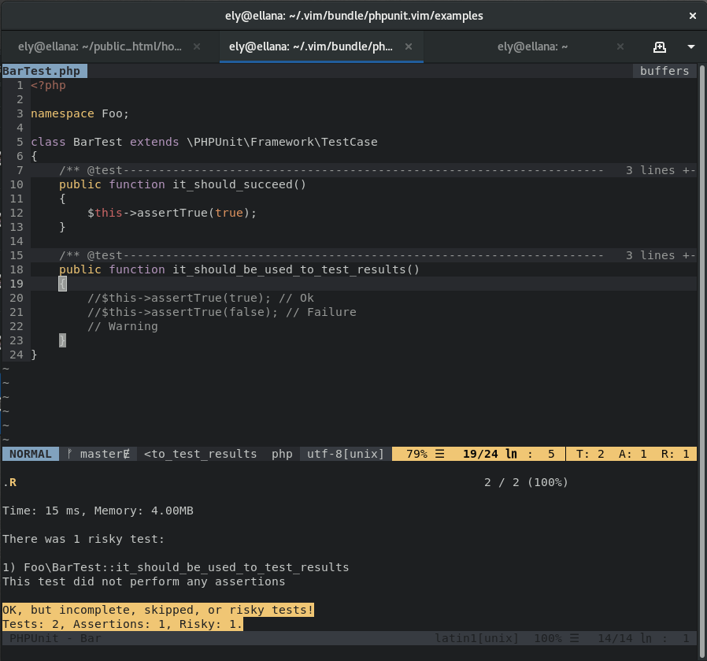

# Updated phpunit.vim

This is an updated version of the [phpunit.vim](https://github.com/c9s/phpunit.vim), I started this fork to add some simple functionalities like using the preview window, configuring the way to open the tests results window, ...

But at then end, the plugin is currently so different than the original that it became to big to make sense as a pull request.




## Purpose

- Run PHPUnit tests inside Vim.
- Switch easly between sources and tests files.

## Install via Pathogen

```sh
git clone https://github.com/elythyr/phpunit.vim.git ~/.vim/bundle/phpunit.vim
```

## Dependencies

- (optional) [AnsiEscp](https://github.com/vim-scripts/AnsiEsc.vim) plugin, or one of it's [fork](https://github.com/vim-scripts/AnsiEsc.vim/network) for more updates, allow to use ANSI colors provided by PHPUnit instead of using the filetype coloration provided by the plugin.
- (optional) [vim-airline](https://github.com/vim-airline/vim-airline) plugin, no need to introduce it. An extension for vim-ariline is provided, you will need it to have its benefits.

## Commands

- `:PHPUnitRunAll` - Run all tests in the tests directory and open the results
- `:PHPUnitRunCurrentFile` - Run the tests of the current file (can be done from the source file) and open the results
- `:PHPUnitRunFilter` - Like `:PHPUnitRunCurrentFile` but filter the test method with the first argument
- `:PHPUnitClose` - Close the tests results window
- `:PHPUnitSwitchFile` - Switch between source & test file

All the "*Run*" commands can take multiple arguments, they will be forward to the phpunit command line.
For the command `:PHPUnitRunFilter`, the first argument must be the name of the test method to execute.

## Mappings

### Normal mode

The plugin provides four mappings that you can use to define your owns.

```vim
<Plug>PhpunitRunall
<Plug>PhpunitRuncurrentfile
<Plug>PhpunitSwitchfile
<Plug>PhpunitClose
```

Each of these mappings refers to the command of the same name.<br>
There is four predefined mappings for them :

```vim
nmap <Leader>ta <Plug>PhpunitRunall
nmap <Leader>tf <Plug>PhpunitRuncurrentfile
nmap <Leader>ts <Plug>PhpunitSwitchfile
nmap <Leader>tc <Plug>PhpunitClose
```

## vim-airline extension

### Goal

The goal here was to reproduce an aspect of [Infinitest](https://infinitest.github.io/) in Eclipse.<br>
For those whom might not have hear about it, one of the things it does is to run your tests while your are editing your files and show you a summary of the results.

Here it takes the form of a vim-airline plugin which will run the tests of the current file when you save it and make the summary of the results appear in the bottom right (usualy) of your screen.<br>
Coloring the section in green, orange or red if your tests passed, had warnings or errors.

### Commands

The extension provides another command :

- `:PHPUnitRunInStatusLine` - Like `:PHPUnitRunCurrentFile` but do not open the results

## Configurations

##### g:php_bin (default : '')

The PHP's binary to use, if none is provided the PHPUnit binary will be called directly.

##### g:php_ext_pattern (default: '\.p%(hp[3457]?|html)')

The pattern for allowed PHP extensions.<br>
he pattern will be executed as "very magic", for more information: `:h /\v`

##### g:phpunit_bin (default: 'phpunit')

The PHPUnit binary

##### g:phpunit_test_file_suffix (default: 'Test')

The suffix used for the tests files.

##### g:phpunit_test_dir (default: 'tests')

The name of the tests files directory.<br>
The directory will be searched upward.

##### g:phpunit_src_dir (default: 'src')

The name of the sources files directory.<br>
The directory will be searcher upward.<br>
If the directory is `.` then it will be the previous directory of the tests.<br>
Example : if the tests path is `~/project_name/tests` then the sources path will be `~/project_name`

##### g:phpunit_tests_results_in_preview (default: 0)

Allows to open the tests results in the preview window, or in a standard window.

##### g:phpunit_tests_results_position (default: depends on g:phpunit_tests_results_in_preview)

List with the options to provide to the vim command which will open the window for the tests results.<br>
Preview window : `['botright']`<br>
Normal window : `['vertical', 'rightbelow']`

##### g:phpunit_window_size (default: depends on the window orientation)

Defines the size for the tests results window.<br>
Vertical window : 50
Horizontal window : 12

##### g:phpunit_switch_file_to_new_window (default: 1)

Allows to open a new window when swtiching between the source and test file.<br>
Otherwise the file is open in the same window.

##### g:phpunit_switch_file_position (default: `['vertical', 'rightbelow']`)

The position of the new window when switching between the source and test file.

##### g:phpunit_options (default: `['--stop-on-failure']`)

The list of options to provide to PHPUnit.<br>
If you defined your own options il will removes the default.
